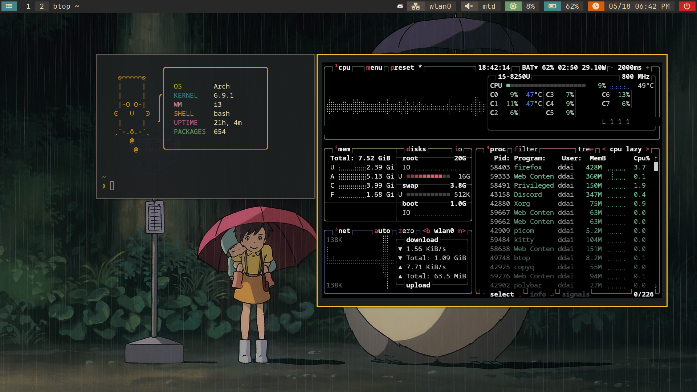

# CouldNot's dotfiles

## Showcase


## Programs used
| Distribution   | [Arch Linux](https://www.archlinux.org)       |
| -------------- | --------------------------------------------- |
| Color scheme   | [Gruvbox](https://github.com/morhetz/gruvbox) |
| Window Manager | [i3](https://www.i3wm.org)                    |
| Compositor     | [picom](https://github.com/yshui/picom)       |
| Bar            | [Polybar](https://github.com/polybar/polybar) |
| Terminal       | [kitty](https://github.com/kovidgoyal/kitty)  |
| Font           | [JetBrains Mono](https://www.jetbrains.com/lp/mono/)  |
| Editor         | [NvChad](https://nvchad.com/)                 |

## Installation
1. Clone this repo:
    ```shell
    git clone https://github.com/CouldNot/dotfiles.git
    ```
2. Navigate to cloned folder location
3. Copy content to config folder location
4. Reboot
